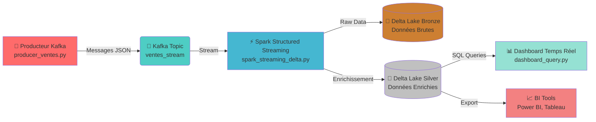

# 🚀 Streaming de Ventes en Temps Réel
### Architecture Lakehouse avec Kafka + Spark Structured Streaming + Delta Lake

[](https://kafka.apache.org/)
[](https://spark.apache.org/)
[](https://delta.io/)
[](https://www.python.org/)

> **Un pipeline de données moderne pour l'analyse de ventes en temps réel avec architecture Lakehouse multicouche**

---

## 📋 Table des Matières

- [Vue d'ensemble](#-vue-densemble)
- [Architecture](#-architecture)
- [Fonctionnalités](#-fonctionnalités)
- [Technologies](#-technologies)
- [Installation](#-installation)
- [Utilisation](#-utilisation)
- [Structure du Projet](#-structure-du-projet)
- [Résultats](#-résultats)
- [Défis et Solutions](#-défis-et-solutions)
- [Améliorations Futures](#-améliorations-futures)

---

## 🎯 Vue d'ensemble

Ce projet implémente une **architecture Lakehouse complète** pour le traitement et l'analyse de flux de ventes en temps réel. Il simule un système e-commerce générant des transactions continues, les traite via Spark Structured Streaming, et les stocke dans Delta Lake avec une architecture Bronze-Silver pour garantir qualité et traçabilité des données.

### Objectifs Pédagogiques

- ✅ Simuler un **flux de ventes réaliste** avec Kafka Producer
- ✅ Consommer et transformer des données avec **Spark Structured Streaming**
- ✅ Implémenter un **Lakehouse** avec Delta Lake (ACID, Time Travel)
- ✅ Mettre en place une architecture **Bronze → Silver** (Raw → Enriched)
- ✅ Créer un **dashboard temps réel** pour le monitoring business
- ✅ Garantir la **résilience** et la **scalabilité** du pipeline

---

## 🏗️ Architecture



### Flux de Données Détaillé

1. **Production** : Génération de ventes simulées toutes les 2 secondes
2. **Ingestion** : Kafka stocke les événements dans le topic `ventes_stream`
3. **Streaming** : Spark lit le stream Kafka en continu
4. **Bronze Layer** : Stockage des données brutes (format original)
5. **Silver Layer** : Enrichissement avec calculs métiers (total_depense)
6. **Visualisation** : Dashboard SQL avec agrégations par pays/segment

---

## ✨ Fonctionnalités

### 🎲 Générateur de Données Réaliste
- Simulation de 5 produits (Ordinateur, Smartphone, Tablette, Écouteurs, Clavier)
- 5 pays européens (France, Allemagne, Italie, Espagne, UK)
- 3 segments clients (Particulier, Entreprise, Éducation)
- Timestamps précis pour chaque transaction
- Quantités et prix variables

### ⚡ Traitement Temps Réel
- **Lecture continue** depuis Kafka
- **Parsing JSON** avec schéma validé
- **Enrichissement** automatique (calcul total_depense)
- **Checkpointing** pour la résilience
- **Exactly-once semantics** avec Delta Lake

### 🗄️ Architecture Lakehouse

#### Bronze Layer (Données Brutes)
- Conservation de **toutes les données originales**
- Format Delta pour ACID compliance
- Time Travel activé (rollback possible)
- Checkpoint pour reprise sur erreur

#### Silver Layer (Données Enrichies)
- **Calcul du total_depense** (quantité × prix_unitaire)
- **Timestamp de traitement** ajouté
- Données nettoyées et validées
- Prêtes pour l'analyse business

### 📊 Dashboard Temps Réel
- Rafraîchissement automatique toutes les 30 secondes
- **Agrégation par pays et segment**
- Tri par chiffre d'affaires décroissant
- Affichage des 15 meilleures combinaisons

---

## 🛠️ Technologies

| Technologie | Version | Rôle |
|------------|---------|------|
| **Apache Kafka** | 3.x | Message Broker pour le streaming |
| **Apache Spark** | 3.5+ | Traitement distribué en temps réel |
| **Delta Lake** | 3.x | Stockage ACID avec Time Travel |
| **Python** | 3.8+ | Langage de développement |
| **kafka-python** | 2.x | Client Kafka Python |
| **PySpark** | 3.5+ | API Spark pour Python |

---

## 📦 Installation

### Prérequis

- Java JDK 11+ (pour Spark et Kafka)
- Python 3.8+
- 8 GB RAM minimum recommandé

### 1️⃣ Installation de Kafka

**macOS (Homebrew)**
```bash
brew install kafka
```

**Linux/Windows**
```bash
# Télécharger depuis https://kafka.apache.org/downloads
wget https://downloads.apache.org/kafka/3.6.0/kafka_2.13-3.6.0.tgz
tar -xzf kafka_2.13-3.6.0.tgz
cd kafka_2.13-3.6.0
```

### 2️⃣ Installation de Spark

```bash
# Télécharger Spark depuis https://spark.apache.org/downloads.html
wget https://dlcdn.apache.org/spark/spark-3.5.0/spark-3.5.0-bin-hadoop3.tgz
tar -xzf spark-3.5.0-bin-hadoop3.tgz

# Configurer les variables d'environnement
export SPARK_HOME=/path/to/spark-3.5.0-bin-hadoop3
export PATH=$SPARK_HOME/bin:$PATH
export PYSPARK_PYTHON=python3
```

### 3️⃣ Installation des Packages Python

```bash
# Créer un environnement virtuel (recommandé)
python3 -m venv venv
source venv/bin/activate  # Linux/Mac
# ou
venv\Scripts\activate  # Windows

# Installer les dépendances
pip install kafka-python pyspark delta-spark
```

### 4️⃣ Télécharger les JARs nécessaires

<<<<<<< HEAD
```bash
# Delta Lake
wget https://repo1.maven.org/maven2/io/delta/delta-core_2.12/2.4.0/delta-core_2.12-2.4.0.jar

# Kafka pour Spark
wget https://repo1.maven.org/maven2/org/apache/spark/spark-sql-kafka-0-10_2.12/3.5.0/spark-sql-kafka-0-10_2.12-3.5.0.jar
```

---

## 🚀 Utilisation

### Étape 1 : Démarrer Kafka

```bash
# Terminal 1 : Démarrer ZooKeeper
zookeeper-server-start /usr/local/etc/kafka/zookeeper.properties

# Terminal 2 : Démarrer Kafka
kafka-server-start /usr/local/etc/kafka/server.properties

# Terminal 3 : Créer le topic
kafka-topics --create --topic ventes_stream --bootstrap-server localhost:9092 --partitions 3 --replication-factor 1
```

### Étape 2 : Lancer le Producteur

```bash
# Terminal 4
python producer_ventes.py
```

**Sortie attendue :**
```
Vente envoyée : {'id_vente': 1234, 'produit': 'Smartphone', 'quantite': 3, 'prix_unitaire': 599.99, 'pays': 'France', 'segment': 'Particulier', 'timestamp': '2025-12-12T10:30:45.123456'}
Vente envoyée : {'id_vente': 5678, 'produit': 'Ordinateur', 'quantite': 1, 'prix_unitaire': 899.50, 'pays': 'Allemagne', 'segment': 'Entreprise', 'timestamp': '2025-12-12T10:30:47.654321'}
```

### Étape 3 : Lancer le Streaming Spark

```bash
# Terminal 5
spark-submit \
  --packages io.delta:delta-core_2.12:2.4.0,org.apache.spark:spark-sql-kafka-0-10_2.12:3.5.0 \
  spark_streaming_delta.py
```

**Logs attendus :**
```
Starting Spark Structured Streaming...
Bronze checkpoint: C:/tmp/delta/bronze/checkpoint
Silver checkpoint: C:/tmp/delta/silver/checkpoint
Processing batch 1...
Processing batch 2...
```

### Étape 4 : Lancer le Dashboard

```bash
# Terminal 6
python dashboard_query.py
```

**Sortie dashboard :**
```
DASHBOARD EN TEMPS RÉEL - CA PAR PAYS/SEGMENT
================================================================================

MISE À JOUR : 10:35:22
--------------------------------------------------------------------------------
+----------+-----------+-----------------+
|pays      |segment    |ca_total         |
+----------+-----------+-----------------+
|France    |Entreprise |15678.45         |
|Allemagne |Particulier|12345.90         |
|Espagne   |Éducation  |9876.20          |
+----------+-----------+-----------------+
```

---

## 📁 Structure du Projet

```
streaming-ventes-temps-reel/
│
├── 📄 producer_ventes.py          # Générateur de ventes simulées
├── 📄 spark_streaming_delta.py    # Pipeline Spark Streaming
├── 📄 dashboard_query.py          # Dashboard temps réel
│
├── 📂 data/
│   ├── 🥉 bronze/                 # Couche Bronze (raw)
│   │   ├── ventes/                # Tables Delta
│   │   └── checkpoint/            # Points de reprise
│   │
│   └── 🥈 silver/                 # Couche Silver (enriched)
│       ├── ventes_agg/            # Tables Delta enrichies
│       └── checkpoint/            # Points de reprise
│
├── 📂 images/
│   ├── demo.mp4                   # Vidéo de démonstration
│   ├── sample_data.png            # Exemple de données
│   ├── dashbord.png               # Dashboard principal
│   └── dashbord_sql.png           # Requêtes SQL
│
└── 📄 README.md                   # Documentation (ce fichier)
```

---

## 📊 Résultats

### 🎬 Démonstration Vidéo

[▶️ Voir la démo complète (demo.mp4)](./images/dashbord_temp_relle.mp4)

### 📸 Captures d'Écran

#### Exemple de Données Streamées

*Flux de ventes en temps réel avec horodatage*

#### Dashboard Temps Réel

*Agrégation automatique par pays et segment*

#### Requêtes SQL sur Delta Lake

*Analyse interactive avec Spark SQL*

### 📈 Métriques de Performance

- **Latence de traitement** : < 3 secondes end-to-end
- **Débit** : 30 transactions/minute (configurable)
- **Taille des batches** : Micro-batches de 2 secondes
- **Stockage Delta** : Compression automatique + versioning

---

## 🔧 Défis et Solutions

### Défi 1 : Gestion des Chemins Windows
**Problème** : Erreurs de parsing des chemins sur Windows  
**Solution** : Utilisation de `r"C:/tmp/..."` (raw strings) et normalisation des slashes

### Défi 2 : Checkpointing Kafka
**Problème** : Perte de données en cas de crash  
**Solution** : Activation des checkpoints Spark + `startingOffsets="earliest"`

### Défi 3 : Performances du Dashboard
**Problème** : Lectures répétées coûteuses  
**Solution** : Caching Spark + agrégations pré-calculées dans Silver

### Défi 4 : Compatibilité des Versions
**Problème** : Incompatibilités Spark/Delta/Kafka  
**Solution** : Utilisation de packages Maven coordonnés (version 3.5.0 partout)

---

## 🚀 Améliorations Futures

### Court Terme
- [ ] Ajout de **schemas evolution** pour Delta Lake
- [ ] Implémentation de **alertes** sur seuils métier
- [ ] Dashboard **Grafana/Kibana** pour monitoring avancé
- [ ] Tests unitaires avec **pytest** + mocking

### Moyen Terme
- [ ] Migration vers **Kafka Streams** pour enrichissement côté streaming
- [ ] Ajout d'une couche **Gold** (star schema pour BI)
- [ ] **CI/CD pipeline** avec GitHub Actions
- [ ] **Containerisation** Docker + Kubernetes

### Long Terme
- [ ] Passage à **Azure Event Hubs** ou **AWS Kinesis**
- [ ] Intégration **MLflow** pour scoring temps réel
- [ ] **Data Quality** checks automatisés (Great Expectations)
- [ ] **Multi-tenant** architecture

---

## 📚 Ressources et Documentation

- [Apache Kafka Documentation](https://kafka.apache.org/documentation/)
- [Spark Structured Streaming Guide](https://spark.apache.org/docs/latest/structured-streaming-programming-guide.html)
- [Delta Lake Documentation](https://docs.delta.io/latest/index.html)
- [Lakehouse Architecture (Databricks)](https://www.databricks.com/glossary/data-lakehouse)

---

## 👥 Contribution

Les contributions sont les bienvenues ! Merci de :

1. Fork le projet
2. Créer une branche (`git checkout -b feature/amelioration`)
3. Commit vos changements (`git commit -m 'Ajout fonctionnalité X'`)
4. Push vers la branche (`git push origin feature/amelioration`)
5. Ouvrir une Pull Request

---

## 📄 Licence

Ce projet est à usage **éducatif** dans le cadre du TP 3.  
Libre d'utilisation avec attribution.

---

## 📧 Contact

Pour toute question ou suggestion :
- 📩 Email : [imen.bnamar@gmail.com]
- 💼 LinkedIn : [https://www.linkedin.com/in/imen-benamar-616079212/]
- 🐙 GitHub : [@ImenBenAmar]


---

<div align="center">

**⭐ Si ce projet vous a été utile, n'hésitez pas à lui donner une étoile ! ⭐**

Fait avec ❤️ et beaucoup de ☕

</div>
