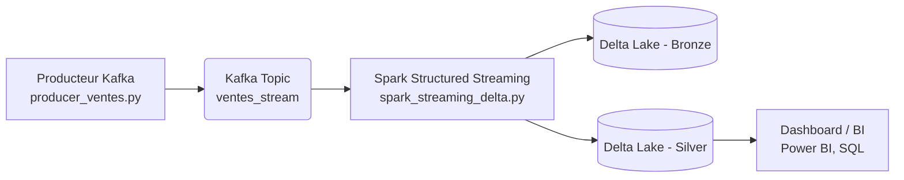

# TP 3 : Streaming de Ventes en Temps Réel  
### Kafka + Spark Structured Streaming + Delta Lake (Lakehouse)

> **Architecture moderne de traitement de données en temps réel**  
> **Objectif pédagogique** : Simuler, consommer, enrichir, stocker et analyser un flux de ventes en continu.

---

## Objectifs Pédagogiques

- Simuler un **flux de ventes en temps réel**  
- Consommer avec **Spark Structured Streaming**  
- Stocker dans **Delta Lake** (ACID, Time Travel)  
- Mettre en place un **modèle Lakehouse** : `Bronze` → `Silver`  
- Supervision et monitoring des flux  
- Production de données réalistes  

---

## Architecture Globale

## installation :

# 1. Apache Kafka + ZooKeeper
brew install kafka
# ou https://kafka.apache.org/quickstart

# 2. Apache Spark 3.5+
https://spark.apache.org/downloads.html
export SPARK_HOME=/path/to/spark
export PYSPARK_PYTHON=python3

# 3. Delta Lake
pip install delta-spark

# 4. Python packages
pip install kafka-python pyspark
